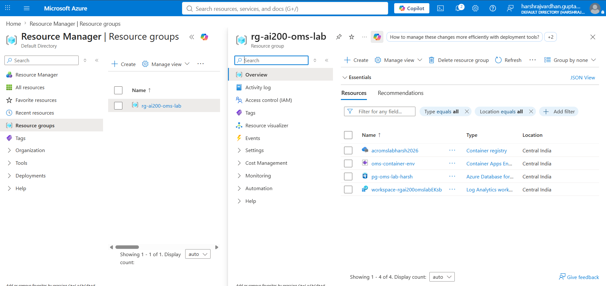
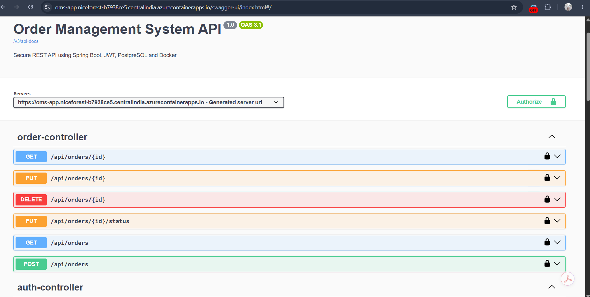

# Order Management System

<p align="center">
  
  
  
  
  
  
  
</p>

A cloud-native **Order Management System** built with **Java 21**, **Spring Boot 3.2.5**, and **PostgreSQL**, designed using enterprise backend development practices.

The application provides secure **JWT-based authentication**, **role-based authorization**, **RESTful APIs**, **CRUD operations**, **pagination**, **sorting**, **request validation**, **global exception handling**, **Swagger/OpenAPI documentation**, **JUnit & Mockito testing**, and **Docker-based containerization**.

The project is successfully deployed on **Microsoft Azure** using **Azure Container Apps**, **Azure Container Registry (ACR)**, and **Azure Database for PostgreSQL**, with secure configuration through environment variables.

> **Status:** ✅ Production-ready backend application with successful cloud deployment on Microsoft Azure.

---

## Project Architecture

<p align="center">
  
</p>

### Local Development (Docker Compose)

The application supports local development using Docker Compose with two containers:

- **oms-app** – Spring Boot REST API (Port **8080**)
- **oms-postgres** – PostgreSQL Database (Port **5432**)

Both containers communicate over Docker Compose's internal network, providing an isolated and reproducible development environment.

---

## Azure Deployment Architecture

The application is deployed on Microsoft Azure using a container-based architecture.

```text
                 GitHub Repository
                       │
                       ▼
           Build Docker Image
                       │
                       ▼
    Azure Container Registry (ACR)
                       │
                       ▼
Azure Container Apps (Spring Boot API)
          │                      │
          │                      ▼
          │          Container App Secrets
          │                      │
          └──────────────┬───────┘
                         ▼
      Azure Database for PostgreSQL (SSL)

      Client / Swagger UI / Postman
                 │
                 ▼
     Azure Container Apps Endpoint
```

### Azure Resource Group
<p align="center">
  
</p>

### Docker Containers
<p align="center">
  
</p>


### Deployment Status

✅ Successfully deployed on Microsoft Azure

### Azure Services Used

| Azure Service | Purpose |
|---------------|---------|
| Azure Container Apps | Hosts the Spring Boot REST API |
| Azure Container Registry (ACR) | Stores and manages Docker container images |
| Azure Database for PostgreSQL | Managed relational database service |
| Container App Secrets | Securely stores database connection settings |

### Deployment Highlights

- Dockerized Spring Boot application deployed to Azure Container Apps
- Docker images stored in Azure Container Registry (ACR)
- Managed Azure Database for PostgreSQL with SSL connectivity
- Secure database configuration using Azure Container App Secrets
- JWT-based authentication and role-based authorization
- REST APIs verified using Swagger UI and Postman
- HTTPS-enabled deployment through Azure Container Apps
- Production-ready cloud-native deployment architecture

---

## Features

- Secure user registration and login using JWT authentication
- Role-based access control (`ADMIN` and `USER`)
- Complete CRUD operations for order management
- RESTful API architecture following Spring Boot best practices
- Pagination and sorting support for order retrieval
- Request validation using Jakarta Validation
- Global exception handling with standardized API responses
- Interactive API documentation using Swagger/OpenAPI
- PostgreSQL database integration with Spring Data JPA and Hibernate
- Containerized application using Docker and Docker Compose
- Cloud-native deployment using Microsoft Azure Container Apps
- Managed Azure Database for PostgreSQL integration
- Secure configuration using environment variables
- Unit testing with JUnit 5 and Mockito
- Integration testing with MockMvc
- Layered architecture (Controller → Service → Repository)

---

## Technology Stack

| Category | Technology |
|----------|------------|
| Language | Java 21 |
| Framework | Spring Boot 3.2.5 |
| Security | Spring Security, JWT |
| Database | PostgreSQL 17 |
| ORM | Hibernate, Spring Data JPA |
| API Documentation | Swagger / OpenAPI |
| Testing | JUnit 5, Mockito, MockMvc |
| Containerization | Docker, Docker Compose |
| Cloud Platform | Microsoft Azure Container Apps, Azure Container Registry |
| Database Hosting | Azure Database for PostgreSQL |
| Build Tool | Maven |
| Version Control | Git, GitHub |

---

## API Request Flow

```text
Client / Swagger / Postman
            │
            ▼
     REST Controller
            │
            ▼
 Spring Security Filter Chain
            │
            ▼
     JWT Validation
            │
            ▼
      Service Layer
            │
            ▼
   Spring Data JPA
            │
            ▼
      PostgreSQL
```

---

## Project Structure

```text
order-management-system
│
├── docs/
│   ├── oms-architecture.png
│   ├── swagger-ui.png
│   ├── azure-container-app.png
│   ├── azure-postgresql.png
│   └── azure-acr.png
│
├── src/
│   ├── main/
│   │   ├── java/
│   │   │   └── ordermanagement/
│   │   │       ├── app/
│   │   │       ├── authcontroller/
│   │   │       ├── config/
│   │   │       ├── entity/
│   │   │       ├── exception/
│   │   │       ├── ordercontroller/
│   │   │       ├── orderdto/
│   │   │       ├── orderservice/
│   │   │       ├── repository/
│   │   │       ├── security/
│   │   │       └── util/
│   │   │
│   │   └── resources/
│   │       ├── application.properties
│   │       └── static/
│   │
│   └── test/
│       └── java/
│           └── ordermanagement/
│
├── Dockerfile
├── docker-compose.yml
├── pom.xml
├── README.md
├── LICENSE
└── .gitignore
```

---

## Package Overview

| Package | Description |
|----------|-------------|
| `authcontroller` | Handles user registration, login, and JWT authentication endpoints |
| `ordercontroller` | Exposes REST APIs for order management operations |
| `orderservice` | Implements business logic and order processing |
| `repository` | Provides database access using Spring Data JPA |
| `entity` | Contains JPA entity classes representing database tables |
| `orderdto` | Defines request and response Data Transfer Objects (DTOs) |
| `security` | Configures Spring Security, JWT authentication, and authorization |
| `config` | Application configuration, Swagger/OpenAPI, and bean definitions |
| `exception` | Centralized exception handling and custom exceptions |
| `util` | Utility and helper classes |
| `test` | Unit and integration tests for application components |

---

## REST API Endpoints

### Authentication

| Method | Endpoint | Description |
|---|---|---|
| `POST` | `/auth/register` | Register a new user |
| `POST` | `/auth/login` | Authenticate and generate a JWT token |

### Orders

| Method | Endpoint | Description |
|---|---|---|
| `POST` | `/api/orders` | Create a new order |
| `GET` | `/api/orders` | Get all orders with pagination and sorting |
| `GET` | `/api/orders/{id}` | Get an order by ID |
| `PUT` | `/api/orders/{id}` | Update an existing order |
| `DELETE` | `/api/orders/{id}` | Delete an order |

---

## Swagger UI

Interactive API documentation is available through Swagger UI for testing and exploring all REST endpoints.

<p align="center">
  
</p>

### Local Development

After starting the application locally:

```text
http://localhost:8080/swagger-ui/index.html
```

<p align="center">
  

</p>

```text
https://oms-app.niceforest-b7938ce5.centralindia.azurecontainerapps.io/swagger-ui/index.html#/
```

### Features Available

- View all REST API endpoints
- Test APIs directly from the browser
- JWT Bearer token authentication
- Request and response schemas
- HTTP status code documentation
- OpenAPI 3.0 specification support

> **Note:** Click the **Authorize** button in Swagger UI and provide a valid JWT Bearer token to access secured endpoints.
---

### Azure Services Used

| Azure Service | Purpose |
|---------------|---------|
| Azure Container Apps | Hosts the Spring Boot REST API |
| Azure Container Registry (ACR) | Stores and manages Docker container images |
| Azure Database for PostgreSQL | Managed PostgreSQL database with SSL connectivity |
| Container App Secrets | Securely stores database connection settings |

### Deployment Workflow

```text
GitHub Repository
        │
        ▼
Build Docker Image
        │
        ▼
Azure Container Registry (ACR)
        │
        ▼
Azure Container Apps
        │
        ▼
Azure Database for PostgreSQL
```

### Deployment Highlights

- ✅ Dockerized Spring Boot application
- ✅ Container image stored in Azure Container Registry (ACR)
- ✅ Deployed to Azure Container Apps
- ✅ Azure Database for PostgreSQL integration
- ✅ Secure configuration using Container App Secrets
- ✅ JWT authentication and role-based authorization
- ✅ REST APIs tested using Swagger UI and Postman
- ✅ HTTPS-enabled cloud deployment

---

## Running the Application

1. Clone the repository
2. Configure environment variables
3. Build the application
4. Start Docker Compose
5. Verify the application
6. Run tests

### Prerequisites

Make sure the following tools are installed:

- Java 21
- Maven
- Docker Desktop
- Docker Compose
- Git

### Clone the Repository

```bash
git clone https://github.com/meharshrajvardhan/order-management-system.git
cd order-management-system
```

### Configure Environment Variables

Create a `.env` file in the project root:

```env
DB_URL=jdbc:postgresql://localhost:5432/order_management_db
DB_USERNAME=postgres
DB_PASSWORD=your_postgresql_password
JWT_SECRET=your_secure_jwt_secret
```

> **Note:** The `.env` file contains sensitive information and is ignored by Git using `.gitignore`.

## Verify the Application

Once the containers are running, open:

```text
http://localhost:8080/swagger-ui/index.html
```

Verify that:

- Application starts successfully
- Swagger UI loads
- Authentication endpoints are accessible
- Order APIs are available

### Build the Application

```bash
mvn clean package
```

### Run with Docker Compose

```bash
docker compose up -d --build
```

### Verify the Containers

```bash
docker compose ps
```

Expected containers:

```text
oms-app
oms-postgres
```

### View Application Logs

```bash
docker compose logs -f oms-app
```

### Run Tests

```bash
mvn test
```

### Stop the Containers

```bash
docker compose down
```

To also remove the PostgreSQL volume:

```bash
docker compose down -v
```

---

## Testing

The project includes:

- Unit testing using JUnit 5
- Service layer testing with Mockito
- Integration testing using MockMvc
- Spring Security authorization testing
- REST API validation
- Database integration testing with PostgreSQL

Run all tests:

```bash
mvn test
```

Build and package the application:

```bash
mvn clean package
```

---

## Security

The application implements enterprise-grade security using Spring Security and JWT authentication.

### Security Features

- JWT-based authentication
- Role-based authorization (`ADMIN`, `USER`)
- Password encryption using BCrypt
- Protected REST endpoints
- Stateless authentication
- Secure configuration through environment variables

### Authorization Header

All secured endpoints require a valid JWT token:

```text
Authorization: Bearer <your-jwt-token>
```

---
## Future Enhancements

- Implement GitHub Actions CI/CD pipeline
- Add Azure Monitor and Application Insights
- Introduce Redis caching
- Build a React frontend
- Add order search and advanced filtering
- Add audit logging
- Implement API rate limiting
- Support Kubernetes deployment
- Refactor selected modules into microservices

---

## Author

**Harsh Rajvardhan**

- GitHub: [github.com/meharshrajvardhan](https://github.com/meharshrajvardhan)
- LinkedIn: [linkedin.com/in/harshrajvardhangupta](https://www.linkedin.com/in/harshrajvardhangupta/)
