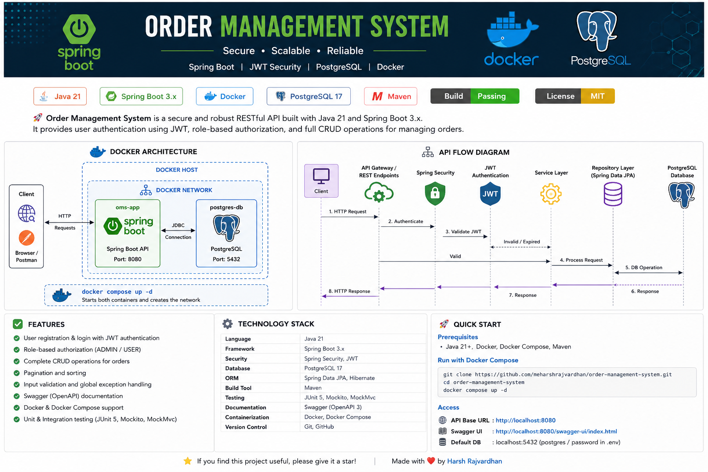

# Order Management System

<p align="center">
  
  
  
  
  
</p>

A secure RESTful backend application built with **Java 21** and **Spring Boot 3.2.5** for managing users and customer orders.

The application provides JWT-based authentication, role-based authorization, CRUD operations, pagination, sorting, request validation, global exception handling, Swagger documentation, automated testing, and Docker-based deployment.

---

## Project Architecture

<p align="center">
  
</p>

The application runs using Docker Compose with two containers:

- `oms-app` — Spring Boot REST API running on port `8080`
- `oms-postgres` — PostgreSQL database running on port `5432`

The application container communicates with PostgreSQL through the internal Docker Compose network.

---

## Features

- User registration and login using JWT authentication
- Role-based authorization with `ADMIN` and `USER` roles
- CRUD operations for order management
- RESTful API design
- Pagination and sorting
- Request validation
- Global exception handling
- Swagger and OpenAPI documentation
- Docker and Docker Compose support
- Unit testing using JUnit 5 and Mockito
- Integration testing using MockMvc
- PostgreSQL database persistence
- Layered backend architecture

---

## Technology Stack

| Category | Technology |
|---|---|
| Language | Java 21 |
| Framework | Spring Boot 3.2.5 |
| Security | Spring Security, JWT |
| Database | PostgreSQL 17 |
| ORM | Hibernate, Spring Data JPA |
| API Documentation | Swagger, OpenAPI |
| Testing | JUnit 5, Mockito, MockMvc |
| Containerization | Docker, Docker Compose |
| Build Tool | Maven |
| Version Control | Git, GitHub |

---

## API Request Flow

```text
Client / Swagger / Postman
            │
            ▼
     REST Controller
            │
            ▼
 Spring Security Filter Chain
            │
            ▼
     JWT Validation
            │
            ▼
      Service Layer
            │
            ▼
   Spring Data JPA
            │
            ▼
      PostgreSQL
```

---

## Project Structure

```text
order-management-system
│
├── docs
│   ├── oms-architecture.png
│   └── swagger-ui.png
│
├── src
│   ├── main
│   │   ├── java
│   │   │   └── ordermanagement
│   │   │       ├── app
│   │   │       ├── authcontroller
│   │   │       ├── config
│   │   │       ├── entity
│   │   │       ├── exception
│   │   │       ├── ordercontroller
│   │   │       ├── orderdto
│   │   │       ├── orderservice
│   │   │       ├── repository
│   │   │       ├── security
│   │   │       └── util
│   │   │
│   │   └── resources
│   │       └── application.properties
│   │
│   └── test
│       └── java
│           └── ordermanagement
│               ├── ordercontroller
│               └── orderservice
│
├── Dockerfile
├── docker-compose.yml
├── pom.xml
├── README.md
└── .gitignore
```

> Remove `swagger-ui.png` from this structure if you have not added the screenshot to the `docs` folder yet.

---

## Package Overview

| Package | Description |
|---|---|
| `authcontroller` | User registration and authentication endpoints |
| `ordercontroller` | Order management REST endpoints |
| `orderservice` | Business logic and order processing |
| `repository` | Database access using Spring Data JPA |
| `entity` | JPA entity classes |
| `orderdto` | Request and response DTOs |
| `security` | JWT authentication and Spring Security configuration |
| `config` | OpenAPI and application configuration |
| `exception` | Global exception handling |
| `util` | Utility classes |
| `test` | Unit and integration tests |

---

## REST API Endpoints

### Authentication

| Method | Endpoint | Description |
|---|---|---|
| `POST` | `/auth/register` | Register a new user |
| `POST` | `/auth/login` | Authenticate and generate a JWT token |

### Orders

| Method | Endpoint | Description |
|---|---|---|
| `POST` | `/api/orders` | Create a new order |
| `GET` | `/api/orders` | Get all orders with pagination and sorting |
| `GET` | `/api/orders/{id}` | Get an order by ID |
| `PUT` | `/api/orders/{id}` | Update an existing order |
| `DELETE` | `/api/orders/{id}` | Delete an order |

---

## Swagger UI

<p align="center">
  
</p>

Interactive API documentation is available after starting the application:

```text
http://localhost:8080/swagger-ui/index.html
```

> Remove the image block above if `docs/swagger-ui.png` has not been added yet.

---

## Running the Application

### Prerequisites

Make sure the following tools are installed:

- Java 21
- Maven
- Docker Desktop
- Docker Compose
- Git

### Clone the Repository

```bash
git clone https://github.com/meharshrajvardhan/order-management-system.git
cd order-management-system
```

### Configure the Database Password

Create a `.env` file in the project root:

```env
DB_PASSWORD=your_postgresql_password
```

The `.env` file should remain ignored by Git.

### Build the Application

```bash
mvn clean package
```

### Run with Docker Compose

```bash
docker compose up -d --build
```

### Verify the Containers

```bash
docker compose ps
```

Expected containers:

```text
oms-app
oms-postgres
```

### View Application Logs

```bash
docker compose logs -f oms-app
```

### Run Tests

```bash
mvn test
```

### Stop the Containers

```bash
docker compose down
```

To also remove the PostgreSQL volume:

```bash
docker compose down -v
```

---

## Testing

The project includes:

- Unit tests for the service layer using JUnit 5 and Mockito
- Integration tests for REST endpoints using MockMvc
- Spring Security authorization testing using mock users
- Database integration testing with PostgreSQL

Run all tests using:

```bash
mvn test
```

---

## Security

The application uses:

- Spring Security
- JWT-based authentication
- Role-based authorization
- Password encryption
- Protected order endpoints
- Public authentication endpoints

Clients must include the JWT token in secured requests:

```text
Authorization: Bearer <your-jwt-token>
```

---

## Future Enhancements

- Deploy the application to Azure App Service
- Use Azure Database for PostgreSQL
- Push Docker images to Azure Container Registry
- Add GitHub Actions CI/CD
- Add a real build-status badge
- Introduce Redis caching
- Build a React frontend
- Add order search and filtering
- Add audit logging
- Refactor selected modules into microservices

---

## Author

**Harsh Rajvardhan**

- GitHub: [github.com/meharshrajvardhan](https://github.com/meharshrajvardhan)
- Portfolio: [harshstackdev.me](https://harshstackdev.me)
- LinkedIn: [linkedin.com/in/harshrajvardhangupta](https://www.linkedin.com/in/harshrajvardhangupta/)
