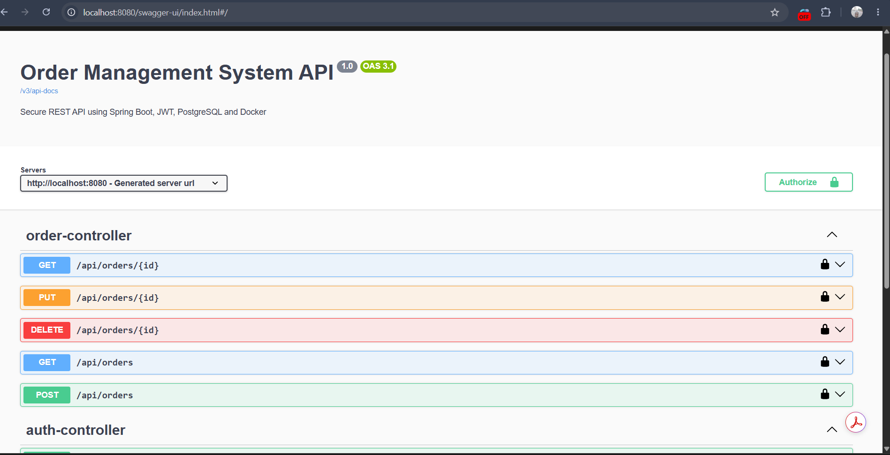
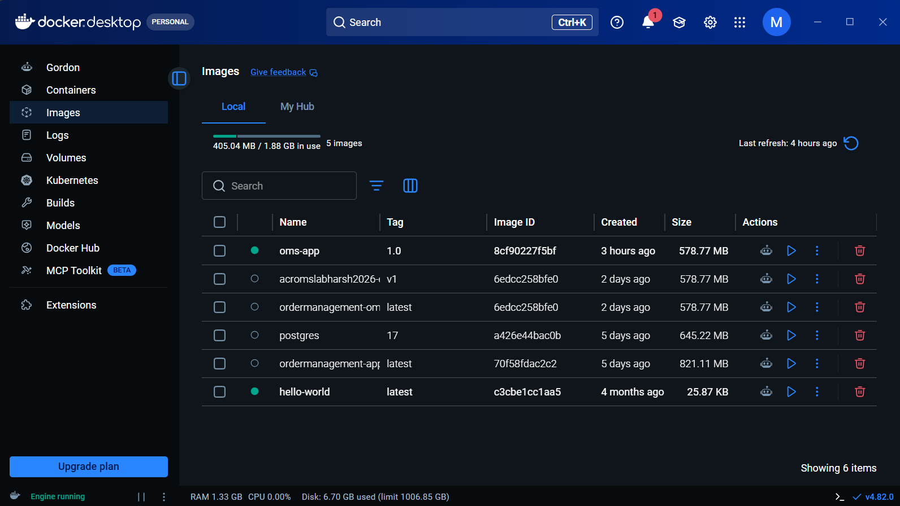
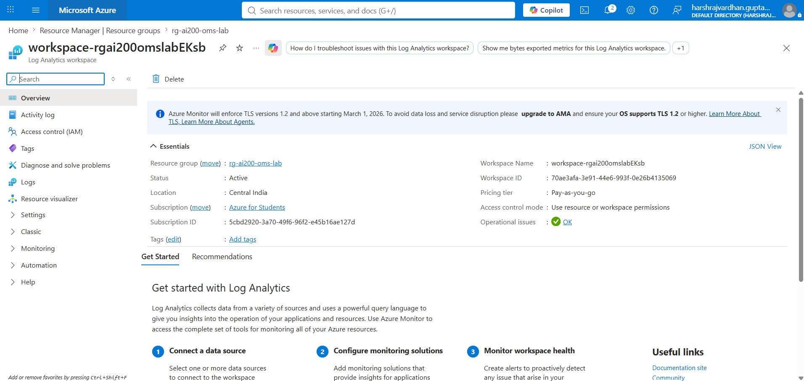

# Order Management System Backend

<p align="center">
  
  
  
  
  
  
  
</p>

A secure REST API for the Full-Stack Order Management System, built with Java 21, Spring Boot 3.5.3, Spring Security, JWT, Spring Data JPA, Hibernate, and PostgreSQL.

The backend provides authentication, role-based authorization, customer order ownership, administrator order operations, pagination, sorting, validation, OpenAPI documentation, automated testing, Docker support, and environment-based configuration.

## Status

- Backend compilation: passed
- Unit tests: passed
- Integration tests: passed
- PostgreSQL integration: verified
- JWT authentication: verified
- Customer order ownership: verified
- Administrator operations: verified
- Docker and Azure deployment files: included

Cloud availability depends on whether the corresponding Azure resources are currently active.

## Core Features

### Authentication

- User registration and login
- BCrypt password encryption
- Stateless JWT authentication
- JWT username and role claims
- Token expiration validation
- Environment-based JWT signing secret
- Public registration always creates a `USER`
- Public requests cannot create `ADMIN` accounts

### Customer Operations

- Create an order
- Associate each order with the authenticated user
- View only orders belonging to the current user
- Track order status
- Prevent customers from viewing all customer orders
- Prevent customers from updating or deleting orders

### Administrator Operations

- View all customer orders
- Server-side pagination and sorting
- Search and filter orders
- View an order by ID
- Update complete order details
- Update only the order status
- Delete orders
- Access protected administrator endpoints

## Security Model

| Operation | USER | ADMIN |
|---|---:|---:|
| Register and log in | Yes | Yes |
| Create an order | Yes | Yes |
| View personal orders | Yes | No |
| View all orders | No | Yes |
| View order by ID | No | Yes |
| Update order details | No | Yes |
| Update order status | No | Yes |
| Delete orders | No | Yes |

The backend is the final authorization layer. Frontend route protection does not replace Spring Security.

## Technology Stack

| Category | Technology |
|---|---|
| Language | Java 21 |
| Framework | Spring Boot 3.5.3 |
| Web | Spring MVC |
| Security | Spring Security, JWT, BCrypt |
| Persistence | Spring Data JPA, Hibernate |
| Database | PostgreSQL 17 |
| Validation | Jakarta Validation |
| API Documentation | Swagger / OpenAPI |
| Testing | JUnit 5, Mockito, MockMvc |
| Build | Maven |
| Containers | Docker, Docker Compose |
| Cloud | Azure Container Apps, Azure Container Registry |
| Cloud Database | Azure Database for PostgreSQL |
| Version Control | Git, GitHub |

## Application Architecture

<p align="center">
  
</p>

```text
React / Swagger / Postman
            |
            v
 Spring Security Filter Chain
            |
            v
       JWT Validation
            |
            v
      REST Controller
            |
            v
       Service Layer
            |
            v
   Spring Data Repository
            |
            v
        PostgreSQL
```

## Project Structure

```text
ordermanagement/
├── docs/
│   ├── oms-architecture.png
│   ├── swagger-ui.png
│   ├── azure-container-app.png
│   ├── azure-postgresql.png
│   └── azure-acr.png
│
├── src/
│   ├── main/
│   │   ├── java/
│   │   │   └── ordermanagement/
│   │   │       ├── app/
│   │   │       ├── authcontroller/
│   │   │       ├── config/
│   │   │       ├── ordercontroller/
│   │   │       ├── orderdto/
│   │   │       ├── orderentity/
│   │   │       ├── orderrepository/
│   │   │       ├── orderservice/
│   │   │       └── security/
│   │   │
│   │   └── resources/
│   │       └── application.properties
│   │
│   └── test/
│       └── java/
│           └── ordermanagement/
│               ├── ordercontroller/
│               └── orderservice/
│
├── .dockerignore
├── .gitignore
├── Dockerfile
├── docker-compose.yml
├── LICENSE
├── pom.xml
└── README.md
```

## Package Overview

| Package | Responsibility |
|---|---|
| `app` | Spring Boot application entry point |
| `authcontroller` | Registration and login endpoints |
| `config` | OpenAPI and application configuration |
| `ordercontroller` | Order, product, health, and home endpoints |
| `orderdto` | Request and response DTOs |
| `orderentity` | JPA entities and order status enum |
| `orderrepository` | Spring Data JPA repositories |
| `orderservice` | Business rules and order ownership logic |
| `security` | Spring Security, JWT filter, JWT utility, and user-details logic |

## Main REST Endpoints

### Authentication

| Method | Endpoint | Access | Description |
|---|---|---|---|
| `POST` | `/api/auth/register` | Public | Register a new `USER` |
| `POST` | `/api/auth/login` | Public | Authenticate and receive a JWT |

### Customer Orders

| Method | Endpoint | Access | Description |
|---|---|---|---|
| `POST` | `/api/orders` | Authenticated | Create an order for the logged-in user |
| `GET` | `/api/orders/my-orders` | USER | View personal orders |

### Administrator Orders

| Method | Endpoint | Access | Description |
|---|---|---|---|
| `GET` | `/api/orders` | ADMIN | View paginated customer orders |
| `GET` | `/api/orders/{id}` | ADMIN | View an order by ID |
| `PUT` | `/api/orders/{id}` | ADMIN | Update complete order details |
| `PUT` | `/api/orders/{id}/status` | ADMIN | Update order status |
| `DELETE` | `/api/orders/{id}` | ADMIN | Delete an order |

### General

| Method | Endpoint | Access | Description |
|---|---|---|---|
| `GET` | `/healthz` | Public | Application health check |
| `GET` | `/swagger-ui/index.html` | Public | Swagger UI |
| `GET` | `/v3/api-docs` | Public | OpenAPI specification |

## Pagination and Sorting

The administrator order endpoint supports pagination and sorting:

```text
GET /api/orders?page=0&size=10&sortBy=id&direction=desc
```

Supported query parameters:

| Parameter | Default | Purpose |
|---|---|---|
| `page` | `0` | Zero-based page number |
| `size` | `5` | Number of orders per page |
| `sortBy` | `id` | Entity field used for sorting |
| `direction` | `asc` | `asc` or `desc` |

Optional filtering is supported using parameters such as `status` and `customer`.

## Swagger / OpenAPI

Local Swagger UI:

```text
http://localhost:8080/swagger-ui/index.html
```

<p align="center">
  
</p>

To access secured endpoints:

1. Log in using `/api/auth/login`.
2. Copy the generated JWT.
3. Click **Authorize** in Swagger UI.
4. Enter:

```text
Bearer <your-jwt-token>
```

## Local Configuration

The application reads configuration from environment variables:

```properties
server.port=${PORT:8080}
spring.datasource.url=${DB_URL:jdbc:postgresql://localhost:5432/order_management_db}
spring.datasource.username=${DB_USERNAME:postgres}
spring.datasource.password=${DB_PASSWORD:}
jwt.secret=${JWT_SECRET}
```

### Required Local Variables

Configure these in the Eclipse Java Application run configuration:

```text
DB_URL=jdbc:postgresql://localhost:5432/order_management_db
DB_USERNAME=postgres
DB_PASSWORD=<your-postgresql-password>
JWT_SECRET=<minimum-32-character-secret>
```

Never commit actual passwords or JWT secrets.

## Database Setup

Create the local PostgreSQL database:

```sql
CREATE DATABASE order_management_db;
```

Hibernate manages the application tables using:

```properties
spring.jpa.hibernate.ddl-auto=update
```

## Running with Eclipse

1. Import `ordermanagement` as an existing Maven project.
2. Select Java 21.
3. Run **Maven → Update Project**.
4. Add the required environment variables.
5. Open `ordermanagement.app.App`.
6. Select **Run As → Java Application**.

The backend starts on:

```text
http://localhost:8080
```

## Maven Build and Testing

Compile and run tests:

```bash
mvn clean test
```

Package the application:

```bash
mvn clean package
```

Validated result:

```text
Tests run: 2, Failures: 0, Errors: 0, Skipped: 0
BUILD SUCCESS
```

The integration test requires access to the configured PostgreSQL database.

## Automated Tests

### OrderServiceTest

Validates:

- Order creation
- Authenticated user lookup
- Order ownership
- Amount calculation
- Repository interaction
- Response mapping

### OrderControllerIntegrationTest

Validates:

- Spring application context
- Authentication integration
- Controller request handling
- PostgreSQL persistence
- Order creation
- Transaction rollback after testing

A separate test-only JWT secret is supplied by the integration-test configuration.

## Docker

### Build and Start

Create a local `.env` file for Docker Compose:

```env
DB_URL=jdbc:postgresql://oms-postgres:5432/order_management_db
DB_USERNAME=postgres
DB_PASSWORD=<your-postgresql-password>
JWT_SECRET=<minimum-32-character-secret>
```

The `.env` file is excluded from Git.

Start the containers:

```bash
docker compose up -d --build
```

Check container status:

```bash
docker compose ps
```

View backend logs:

```bash
docker compose logs -f oms-app
```

Stop containers:

```bash
docker compose down
```

Remove containers and the PostgreSQL volume:

```bash
docker compose down -v
```

Use `down -v` carefully because it deletes the local database volume.

## Docker Architecture

- `oms-app`: Spring Boot REST API on port `8080`
- `oms-postgres`: PostgreSQL on port `5432`
- Both containers communicate through the Docker Compose network.

<p align="center">
  
</p>

## Azure Deployment

The backend deployment architecture uses:

| Azure Service | Purpose |
|---|---|
| Azure Container Registry | Stores the Docker image |
| Azure Container Apps | Hosts the Spring Boot API |
| Azure Database for PostgreSQL | Managed PostgreSQL database |
| Container App Secrets | Stores database and JWT configuration |
| Log Analytics | Collects deployment and runtime logs |

```text
GitHub Repository
        |
        v
Docker Image
        |
        v
Azure Container Registry
        |
        v
Azure Container Apps
        |
        v
Azure Database for PostgreSQL
```

### Deployment Highlights

- Docker image pushed to Azure Container Registry
- Spring Boot API deployed using Azure Container Apps
- Azure Database for PostgreSQL connected using SSL
- Sensitive values stored through container-app secrets
- HTTPS endpoint supplied by Azure Container Apps
- APIs validated using Swagger UI and Postman

<p align="center">
  
</p>

## Frontend

The React frontend is located in the sibling directory:

```text
../oms-frontend
```

It provides:

- Customer registration and login
- Customer dashboard
- Order creation and personal-order tracking
- Administrator dashboard
- Order search, filtering, pagination, status updates, and deletion
- Role-protected navigation

## Security Practices

- BCrypt password hashing
- Stateless JWT authentication
- Role-based endpoint authorization
- Customer order ownership enforcement
- Public registration restricted to `USER`
- Secrets supplied through environment variables
- Local environment files excluded from Git
- Separate test-only JWT secret
- CORS restricted to configured frontend origins

## Future Enhancements

- GitHub Actions CI/CD pipeline
- Refresh-token support
- Centralized structured error responses
- Audit logging
- API rate limiting
- Redis caching
- Azure Monitor and Application Insights
- Testcontainers or an isolated test database
- Kubernetes deployment
- Microservice decomposition where justified

## Author

**Harsh Rajvardhan Gupta**

- GitHub: [github.com/meharshrajvardhan](https://github.com/meharshrajvardhan)
- Portfolio: [harshstackdev.me](https://harshstackdev.me)
- LinkedIn: [linkedin.com/in/harshrajvardhangupta](https://www.linkedin.com/in/harshrajvardhangupta/)